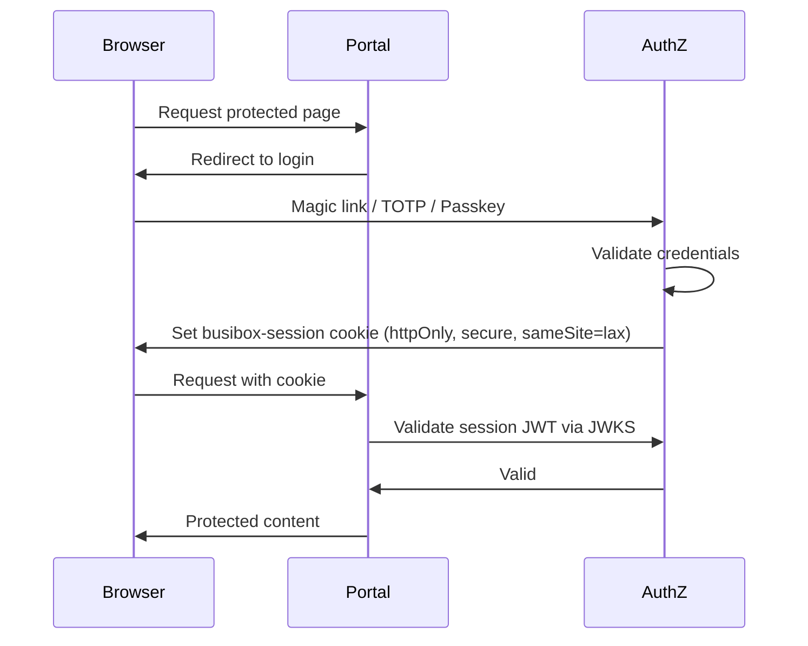

# Authentication Architecture

## Principles

- No static credentials. User operations use the user's JWT. Server-to-server operations use service accounts.
- Public auth endpoints (login, magic link, passkey) do not require prior authentication.
- Session tokens are RS256-signed and validated via authz JWKS.

## Auth Flow

The session JWT is stored in the `busibox-session` cookie. It is RS256-signed, httpOnly, secure, and sameSite=lax. There are no legacy cookies; only this single session cookie is used. The project does not use the better-auth npm package.

## Login Methods

| Method | Description |
|--------|-------------|
| Magic Link | Email code sent to user; user enters code to authenticate |
| TOTP Code | 6-digit code sent via email (TOTP-style flow) |
| Passkey | WebAuthn-based passwordless authentication |

## Token Exchange for Downstream Services

When an app needs to call a backend service (agent-api, ingest-api, data-api), it exchanges the session JWT for an audience-bound token via `exchangeWithSubjectToken()`. Authz verifies the user has access and issues a new token scoped to the requested audience.

Admin operations use the admin user's JWT with admin scopes. No separate service account is used for admin UI actions.

## SSO Flow for Apps

When a user opens an app from the portal:

1. Portal exchanges the session JWT for an app-scoped token via authz.
2. Authz verifies RBAC (user has app access).
3. Authz issues an RS256 token with `app_id` claim.
4. The app validates the token via authz JWKS endpoint.
5. Client-side token exchange uses `POST /api/sso` with the token in the body. Do not use GET with `redirect: 'manual'`; browsers do not process Set-Cookie headers from redirect responses in manual mode.

## Server-Side Auth Middleware

API routes use `requireAuthWithTokenExchange(request, audience)` from each app's local `lib/auth-middleware`. This validates the session, exchanges for the requested audience token, and returns `{ ssoToken, apiToken }` or a 401 response. The underlying token exchange uses `@jazzmind/busibox-app`.

## Environment Variables

| Variable | Purpose |
|----------|---------|
| AUTHZ_BASE_URL | Authz service base URL (e.g. http://authz-lxc:8010) |
| BETTER_AUTH_URL | Portal URL for auth callbacks (used by authz integration) |
| BETTER_AUTH_SECRET | Secret for session signing (used by authz) |
