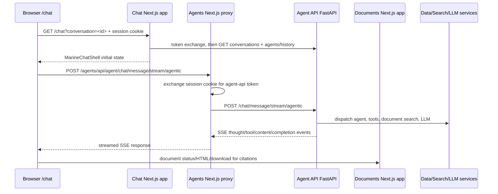

# Chat System Architecture

## Runtime summary

The Chat app is a Next.js app at `/chat` (port 3003 in local development). It has two UI paths:

- `NEXT_PUBLIC_CHAT_BRAND=marine` renders the app-local Marine components in `apps/chat/src/components/chat/themes/marine`.
- Any other value renders the reusable `ChatPage` from `packages/app`.

The authenticated page is a Server Component. It reads the `busibox-session` cookie, rejects expired or malformed session claims, exchanges the session token for an `agent-api` audience token, and creates a server-side `AgentClient`. The Marine server component preloads conversations, the default active `chat` agent, and optional initial history before handing state to `MarineChatShell`.

## Active Marine request flow

This cross-app proxy is intentional. In `ApiContext`, the `agent` API domain is owned by the Agents app, so `resolve('agent', '/api/agent')` becomes `/agents/api/agent`. The catch-all proxy at `apps/agents/src/app/api/agent/[...path]/route.ts` reads the session cookie, exchanges it server-side, forwards the request, and preserves streaming responses.

## Browser routes

| Route | Owner | Purpose |
|---|---|---|
| `/chat` | Chat app | Authenticated chat page; optional `?conversation=<uuid>` |
| `/chat/<conversationId>` | Chat app | Compatibility route; redirects to the query-parameter form |
| `/chat/demo` | Chat app | Public static mock of Marine; no auth, backend, or persistence |
| `/chat/api/auth/session` | Chat app | Session state for the Chat app |
| `/chat/api/health` | Chat app | App health |
| `/chat/api/version` | Chat app | App version |
| `/chat/api/chat/*` | Chat app | App-local BFF routes, including attachments and legacy/shared Chat operations |
| `/agents/api/agent/*` | Agents app | Active cookie-authenticated proxy to Agent API used by Marine CRUD/history/SSE |
| `/documents/api/documents/*` | Documents app | Citation status, HTML, images, page enhancement, and downloads |

## Active Marine endpoints

Browser calls are prefixed by the owning app. The Agents proxy removes `/agents/api/agent` before forwarding to FastAPI. Server preload calls use the internal Agent API URL directly.

| Access path | Backend request | Used for |
|---|---|---|
| Server preload | `GET /agents` | Find the active default `chat` agent |
| Server preload | `GET /conversations` | Initial conversation sidebar |
| Server preload | `GET /chat/<id>/history` | Optional initial selected history |
| `GET /agents/api/agent/conversations` | `GET /conversations` | Browser sidebar refresh |
| `POST /agents/api/agent/conversations` | `POST /conversations` | Start a conversation |
| `DELETE /agents/api/agent/conversations/<id>` | `DELETE /conversations/<id>` | Delete a conversation |
| `GET /agents/api/agent/chat/<id>/history` | `GET /chat/<id>/history` | Browser conversation selection/history |
| `POST /agents/api/agent/chat/message/stream/agentic` | `POST /chat/message/stream/agentic` | Main SSE send path |
| `POST /chat/api/chat/conversations/<id>/attachments` | Agent/Data APIs | Validate, upload/process, and create a chat attachment |
| `GET /documents/api/documents/<fileId>/status` | Documents/Data path | Citation processing status |
| `GET /documents/api/documents/<fileId>/html` | Documents/Data path | Citation document body |

The app also contains `/chat/api/chat` routes for conversations, sharing, insights, models, search, and messages. Do not assume those are in the Marine hot path: trace the calling component before editing them.

## Streaming and persistence

`MarineChatShell` sends through `useChatStream`, which calls `streamChatMessageAgentic`. The stream parser reads SSE `event:` and `data:` lines. `stream-event-processor.ts` is the shared contract mapper for:

- `conversation_created` and `title_update`
- `thought`, `plan`, and `progress`
- `tool_start` and `tool_result`
- `content` and `content_chunk`
- `interim`, `clarify_parallel`, and `prompt`
- `complete`, `message_complete`, and `error`

Document-search tool results are converted into deduplicated live citations. After the stream ends, the hook returns accumulated content/citations and the Marine shell adds the assistant message locally. The backend separately persists user and assistant messages; reloading history is therefore the proof that the stored representation and frontend mapping agree.

## Attachments and citations

The Marine composer first ensures a conversation exists, then uploads files through the Chat app's attachment BFF. The backend attachment ID is sent in `attachment_ids` with the chat request. The Agent API links those rows to the user message and supplies metadata/content to the agent.

Live citations come from `document_search` tool-result events. Stored citations live under the assistant message's `routing_decision.citations`. `MarineSourcePanel` opens the cited file through Documents routes, polls processing status, renders `HtmlViewer`, and links to download. A live citation chip alone does not prove that the cited file is accessible after reload.

## Configuration

| Variable | Effect |
|---|---|
| `NEXT_PUBLIC_CHAT_BRAND` | Selects Marine when equal to `marine` |
| `NEXT_PUBLIC_CHAT_PRODUCT_NAME`, `NEXT_PUBLIC_CHAT_TAGLINE`, `NEXT_PUBLIC_CHAT_SIDEBAR_TITLE`, `NEXT_PUBLIC_CHAT_COMPOSER_PLACEHOLDER`, `NEXT_PUBLIC_CHAT_DISCLAIMER`, `NEXT_PUBLIC_CHAT_EMPTY_HEADING`, `NEXT_PUBLIC_CHAT_SUGGESTED_PROMPTS` | Tenant-facing Marine copy |
| `AGENT_API_URL` | Server-side Agent API URL |
| `AGENT_API_HOST`, `AGENT_API_PORT` | Server fallback for Agent API URL |
| `NEXT_PUBLIC_*_BASE_PATH` | Cross-app browser route ownership |
| `AUTHZ_BASE_URL` | Session-token exchange service |

See [`../guides/chat-multi-agent-work.md`](../guides/chat-multi-agent-work.md) for ownership and verification guidance, and [`../reference/chat-api.md`](../reference/chat-api.md) for endpoint details.
